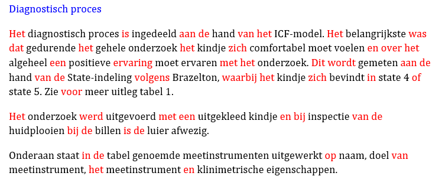

# CORPORA THAT SUPPORT CLINICAL REASONING

This repository attempts to support clinical reasoning by providing tools which:
1. [Generate JSON corpora from case studies](#generating-corpora)
2. [Visualize text modifications](#validating-text-modifications)
3. [Train Natural Language Processing models](#data-science)

## Generating JSON Corpora
`gen_corpora.py` contains a script written to generate different kinds of corpora. Within the root directory the file should be executed as follows:
```shell
   py generate_corpora.py
   ```
The user will be met with the following response:
  ```shell
   --- Which ETL pipeline would you like to use? (1/2/3) ---
   1.       Dynamic ETL with default settings
   2.       Dynamic ETL with custom settings
   3.       Demo ETL
   Pipeline:
   ``` 
 By choosing either of the first two options the program will use a class called `DynamicETL` to generate a JSON-corpora. A complete guide of `Dynamic ETL`, including example usage, can be found in the corresponding [`README.md`](/etl_classes/README.md).

 The default text and paragraph modification settings can be edited and found in [/data_classes/flag.py](/data_classes/flag.py)
 
 `Demo ETL` is incomplete and should not be used

## Visualizing text modifications
To be able to qualitatively validate different text modifications with medical experts on `docx` documents `visualize_corpora.py` has been constructed. By using the following command in CMD all paragrahs from a specified docx document will be aggregated and colored depending on if they meet certain paragraph criteria:
```shell
   py visualize_doc.py
   ```
The input and output locations have to be specified manually by going to the bottom of the file and changing the constants on lines 83-87. The paragraph criteria can be found in the method `visualize_text_modifications` in `visualize_doc.py`
An example output of the document visualiser is as follows:

## Data science
In subdirectory [/data_science](./data_science/) Python files and current NLP-model results can be found. A seperate `README.md` has been defined with further explanation at that location.

## TODO (possible improvements)
### `gen_corpora.py`
- [ ] Change `DEMO ETL` to `Aggregate ETL` in the `gen_corpora.py` choice menu. `Aggregate ETL` is an ETL pipeline which appends all `docx` files from a given directory to one large `docx` file.
- [ ] Perfomance; During execution of `gen_corpora.py` the user has to wait around 5 seconds while the program loads dependencies in the background. To increase usability solution could be either showing the user what is happening or implementing a form of concurrency.
- [ ] Integrate the text visualizer with `gen_corpora.py` to be able to better assess document modifications while also generating corpora using the same changes
- [ ] Be able to choose output data format. Currently only supports JSON and separates document on paragraph basis.
   - [ ] XML output
   - [ ] database output
   - [ ] split text based on sentence (suggestion to use a format like [spaCy's](https://spacy.io/api/data-formats#json-input)) 
### `modifier_vizualizer.py`
- [ ] ability to declare input and output locations from CMD 
- [ ] ability to apply the visualizations on multiple documents (like aggregate pipeline)
- [ ] ability to choose which paragraph criteria to use including the color it should become using parameter in `visualize_text_modifications`